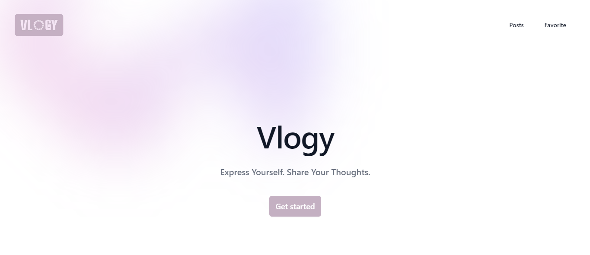
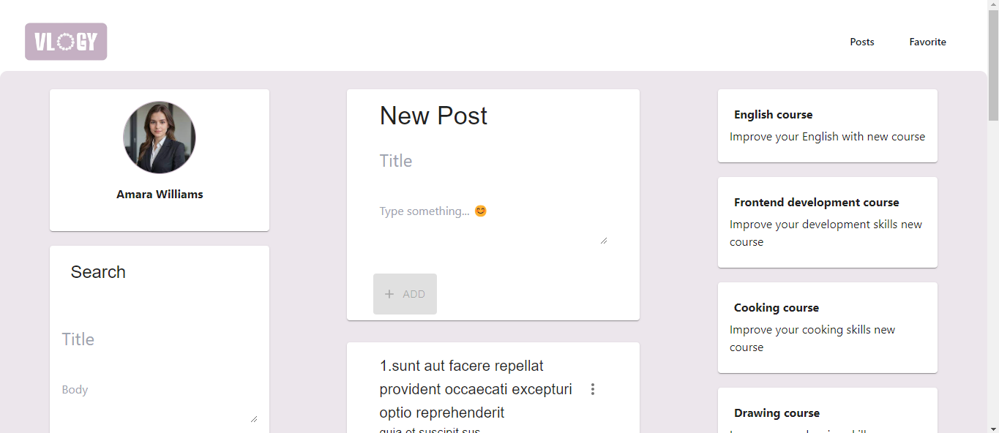

# vlogy

## Overview

Vlogy is a web application designed to display posts , providing an easy-to-use interface for managing and viewing posts.

## Requirements

- **Node.js**: Version 18 or higher is required.

## Scripts

- **Start the Application**: To run the application in development mode, use the following command:

  ```bash
  npm run dev
  
- **Generate Documentation**: use the following command:

  ```bash
  npm run doc

## Features
- Add Post
- Edit Post
- Favorite Post
- Filter Post
- Delete Post

## Demo : [click here](https://vlogy.vercel.app/myFavorite)




